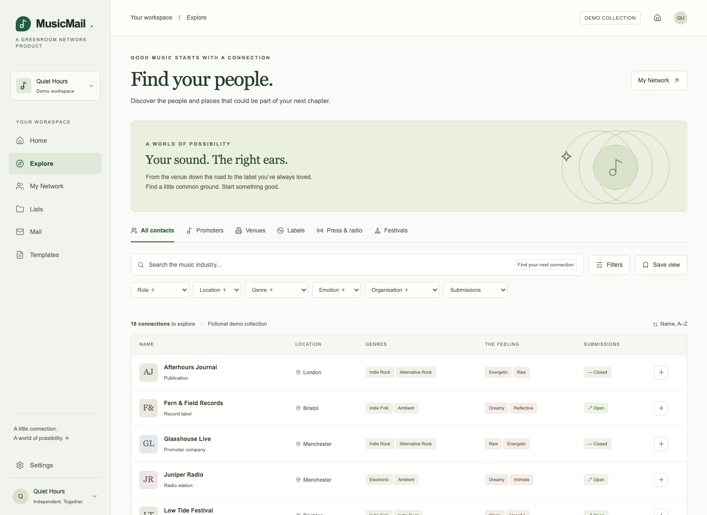
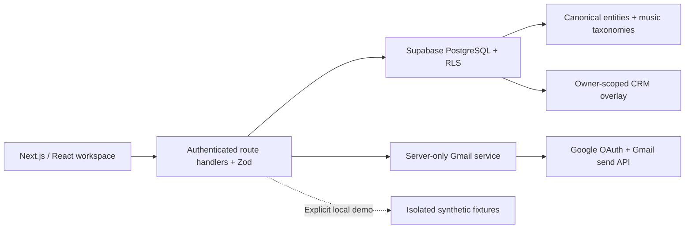

# MusicMail

**Your music industry network, organised.**

MusicMail is a music-native directory, private relationship workspace and personal outreach tool for independent musicians. It is the first product from **GreenRoom Network**.

**Local beta · v0.9.0** — working demonstration and Supabase-backed implementation. Production deployment and live Google OAuth remain release gates; this is deliberately not tagged v1.0.0.



More screenshots: [My Network](docs/screenshots/network-desktop.png) · [Contact details](docs/screenshots/contact-drawer.png) · [Email composer](docs/screenshots/email-composer.png) · [Mobile](docs/screenshots/explore-mobile.png)

## Why it exists

A musician’s professional network is scattered across spreadsheets, inboxes, notes and social profiles. MusicMail brings together who someone is, the music they work with, how to approach them and what happened last time.

The journey is **Discover → Add to Network → Organise → Contact → Follow up**. Genre, emotion, industry role and submission information are built in. There is no empty database to design before getting started.

## Run it locally

Requires Node.js 22.12+ and npm. The included demonstration needs no external accounts.

```bash
npm ci
cp .env.example .env.local
npm run dev
```

Open [localhost:3000](http://localhost:3000), choose **Explore the demo**, or create an artist project through **Get started**. `.env.example` explicitly enables `MUSICMAIL_DEMO=true`.

Demo contacts are **fictional**, use reserved `.example` addresses, and are labelled in the app. Each browser gets a separate workspace stored in ignored `.data/demo/` files. Real emails cannot be sent in demo mode. This adapter is for local demonstration, not serverless production.

For real authentication and durable storage, follow [development setup](docs/development.md) and set `MUSICMAIL_DEMO=false`.

## What you can do

- Set up a solo artist, band, duo or other canonical artist project.
- Explore a paginated directory by role, location, genre, emotion, submission status and contact availability.
- Add a shared entity to your private network without copying the shared record.
- Create private contacts; track relationship, outreach, priority, notes, origins and follow-up dates.
- Use manual lists, saved views, column preferences, inline status changes and contact drawers.
- Import CSV with preview, column mapping, validation and explicit duplicate confirmation; export CSV or complete account JSON.
- Edit templates, personalise and preview individual messages for up to ten contacts.
- Connect Gmail in a configured Supabase environment; send separate messages, with encrypted tokens, suppression checks and durable send records.
- See follow-ups, recent contacts, recent mail and saved views on Home.
- Maintain shared data through a restricted internal admin screen.

No inbox synchronisation, reply detection, tracking pixels, campaigns, social feed or speculative GreenRoom features.

## Architecture



The central design is **one canonical entity identity + a private CRM overlay**. A venue, person, organisation or artist project has one `entities.id`. Roles and relationships describe what it does. Each musician’s `user_contacts` record links to that identity and owns their private relationship data. An imported contact has a null `entity_id` and is never published automatically.

Subtype tables keep venue capacity, person names and artist types out of the universal identity table. This preserves a useful foundation for GreenRoom without building that future platform now. See the [architecture review and ER diagram](docs/architecture.md) and [database guide](docs/database.md).

## Stack

Next.js App Router · React · strict TypeScript · Tailwind CSS · Radix/shadcn-style accessible UI · Supabase Auth/PostgreSQL · Zod · Papa Parse · Lucide · Vitest · React Testing Library · Playwright.

The lockfile pins the installed versions. No hosted service is needed for the local demo or the standalone PostgreSQL integration suite.

## Security

Every database table has RLS. Owner-scoped policies and composite foreign keys prevent cross-user notes and list memberships. Shared writes require administrator membership. Artist onboarding is a narrow transaction that creates a private canonical artist project.

Gmail tokens are AES-256-GCM encrypted, unavailable to the browser and stored in a table without authenticated-user grants. Sends require authenticated ownership, a same-origin request and explicit previews/confirmation. Duplicate attempt IDs cannot send again. Uncertain provider outcomes are reported without automatic retry.

Read [security](docs/security.md), [email security review](docs/email-security.md) and [email delivery behavior](docs/email.md). Technical controls do not establish legal compliance.

## Configuration

| Variable                                    | Purpose                                                        |
| ------------------------------------------- | -------------------------------------------------------------- |
| `MUSICMAIL_DEMO`                            | Explicit local fixture mode; `false` in production             |
| `NEXT_PUBLIC_APP_URL`                       | Exact application origin, used for callbacks and origin checks |
| `NEXT_PUBLIC_SUPABASE_URL`                  | Supabase project API URL                                       |
| `NEXT_PUBLIC_SUPABASE_ANON_KEY`             | Public Supabase key; RLS remains mandatory                     |
| `SUPABASE_SERVICE_ROLE_KEY`                 | Server-only Gmail metadata and account deletion                |
| `GOOGLE_CLIENT_ID` / `GOOGLE_CLIENT_SECRET` | Separate Gmail OAuth configuration                             |
| `APP_ENCRYPTION_KEY`                        | 32 random bytes, base64 encoded; server-only                   |

Never put service credentials or encryption keys in `NEXT_PUBLIC_*` variables. `.env.local`, `.data`, logs and test artifacts are ignored.

## Validation

```bash
npm run typecheck
npm run lint
npm test
npm run test:db       # requires initdb, pg_ctl and psql on PATH
npx playwright install chromium
npm run test:e2e
npm run build
npm audit
```

The PostgreSQL suite starts an isolated temporary cluster, applies every migration, applies the seed twice, and tests real SQL/RLS behavior with two users and an administrator. It uses a small Supabase Auth identity shim; it does not claim to test GoTrue or live OAuth.

Browser tests cover artist setup, Explore, a private relationship, template previews, CSV import, lists, export, session isolation and mobile layout. Additional automated accessibility checks cover WCAG A/AA on key screens. Live Gmail sending needs a configured test account; see [release gates](docs/release-checklist.md).

## Project guide

- [Product and scope](docs/product.md)
- [Architecture and route map](docs/architecture.md)
- [Database, migrations and RLS](docs/database.md)
- [Security and privacy review](docs/security.md)
- [Email integration](docs/email.md)
- [Local development](docs/development.md)
- [Vercel, Supabase and Google setup](docs/deployment.md)
- [Release checklist and known limitations](docs/release-checklist.md)
- [Recorded local verification](docs/verification.md)
- [Changelog](CHANGELOG.md)

## Roadmap

Before 1.0: exercise real Supabase Auth and Gmail in staging, complete consent-screen/operational reviews, load verified professional records, measure realistic data volumes, deploy and pass the full release checklist. Local synthetic records demonstrate the workflow; they are not a production industry dataset.

Later GreenRoom products can reuse canonical entity IDs. Events, ticketing, teams, recommendations and social features remain outside this V1.

## Author

Developed for Nick Suciu / GreenRoom Network. Product and architecture baseline supplied in the MusicMail V1 specification. No deployment URL or production customer metrics are claimed.
