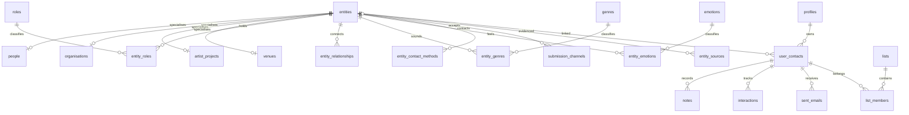

# MusicMail architecture review

Status: implementation baseline, 0.1.0. The repository started empty, with no remote. No change to the specified entity architecture is needed.

## Decisions
Next.js App Router, strict TypeScript, Tailwind, shadcn-style Radix primitives, Zod, Supabase Auth and PostgreSQL. Server route handlers authenticate every request and issue queries under the user's RLS context. Shared discovery uses a paginated SQL function with AND between categories and OR within a category. No client download of the full catalogue.

Canonical `entities.id` identifies every person, organisation, artist project and venue. One-to-one subtype tables hold specialised fields. Taxonomies, relationships, contact methods and provenance reference that identity. `user_contacts` is an owner-scoped overlay; a null entity reference denotes a private contact. Imports never publish entities.

A clearly labelled demo uses synthetic fixtures and a browser-session-scoped server store only when explicitly enabled. It is not an authentication replacement or a production database. Gmail cannot send in demo mode. Hosted production requires Supabase; missing configuration fails closed.

## Final MVP table list
Shared: entities, people, organisations, artist_projects, venues, organisation_types, venue_types, roles, entity_roles, relationship_types, entity_relationships, locations, entity_locations, genres, entity_genres, emotion_families, emotions, entity_emotions, entity_contact_methods, submission_channels, entity_aliases, entity_sources.

Private: profiles, user_preferences, user_contacts, notes, interactions, saved_views, lists, list_members, email_templates, sent_emails. Operational: admin_users, gmail_connections, email_send_attempts. Artist ownership lives in entities.created_by; user-created artist projects begin private, avoiding involuntary publication during onboarding.

## Entity diagram

## Routes and components
Public `/`, `/login`, `/signup`; `/auth/callback`; onboarding `/onboarding`. Workspace `/home`, `/explore`, `/network`, `/lists`, `/mail`, `/templates`, `/settings`; `/admin` is admin-gated. `/app/*` aliases redirect to the corresponding workspace page.

Sidebar and workspace shell wrap route-specific ExploreTable, NetworkTable, AttentionScreen, ListsScreen, MailScreen, TemplatesScreen and SettingsScreen. Shared accessible Dialog powers EntityDrawer, CsvImporter and EmailComposer. Filter state is serialisable; all mutations validate with Zod.

## Services
Route handlers call the domain repository for catalogue queries, CRM operations, import/export, onboarding and admin operations. Supabase is the durable implementation; the isolated demo adapter implements the same contract. Pure helpers handle filtering, CSV validation and template expansion. Gmail is a server-only service, independent of Supabase login.

## RLS plan
Enable RLS on every public table. Shared rows are readable only when their parent entity is public and unarchived, or owned by the current user, or the user is an admin. Shared mutations are admin-only, except a narrowly scoped transactional onboarding function. Private rows require `auth.uid() = user_id` in both USING and WITH CHECK. Composite foreign keys prevent attaching notes, history or list memberships to another user's contact/list. Token and attempt tables have no authenticated grants; service-role access is restricted to Gmail routes after authentication. Admin membership cannot be self-assigned.

## Gmail architecture
Explicit separate consent using gmail.send and identity email scopes; state is random, expiring, HttpOnly and bound to the authenticated user. Tokens are AES-256-GCM encrypted with a server-only key. Server refresh and revoke; no inbox scope. Individually personalised previews, maximum 10 recipients, owner and suppression checks, durable attempt reservation and rate limiting precede sending. Ambiguous transport failures are never retried automatically. Success metadata and contact history commit atomically. External delivery and database commit cannot be one transaction; uncertain outcomes require manual review.

## Migration and implementation sequence
1. Foundation and architecture (0.1.0).
2. Canonical schema, RLS and seed taxonomies; Explore.
3. Onboarding, private network, history, lists and saved views.
4. CSV mapping, preview and export.
5. Gmail security review, OAuth, templates, personalised sends.
6. Attention screen and internal administration.
7. Unit, database isolation and browser tests; accessibility, documentation and deployment configuration.

## Git and release plan
Retain existing main branch and any remote; incremental conventional commits. Annotated milestone tags only after checks. Keep version below 1.0.0 until live OAuth, production deployment and all release criteria pass. Never commit environment secrets, browser profiles or private datasets. No remote or hosted credentials were present at inspection.

## Clarifications
Onboarding artist name is the only required artist field. Public catalogue filters do not reveal private artists. Gmail sender identity is independent of the login email. Demo entities are fictional, with reserved .example addresses; no fabricated contacts are represented as genuine industry data. No Microsoft integration, password-only local auth, inbox sync or later GreenRoom features are added.
